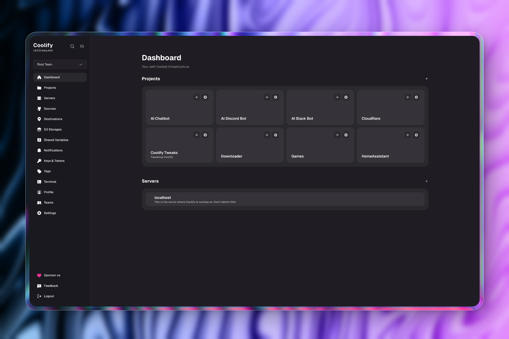
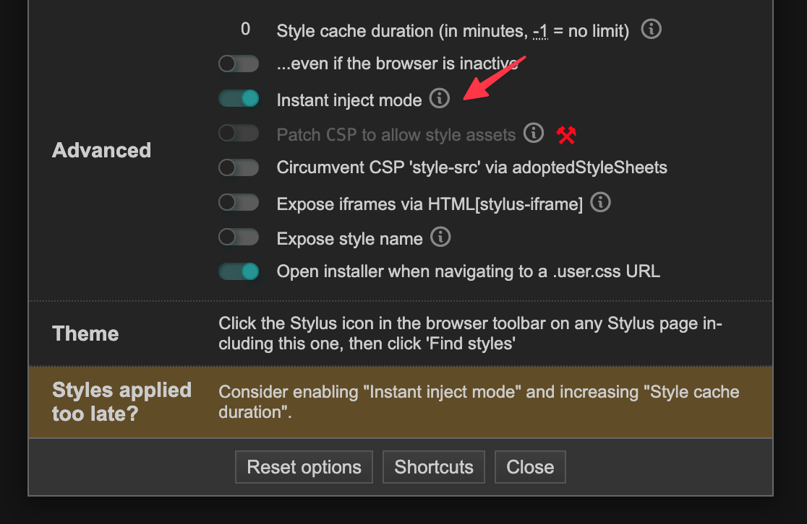

<div align="center">
  
<h1>
  Coolify Tweaks
</h1>

<div>

[](https://github.com/techwithanirudh/coolify-tweaks/releases)
[](https://github.com/techwithanirudh/coolify-tweaks/stargazers)
[](https://github.com/techwithanirudh/coolify-tweaks/network)
[](https://coolify-tweaks-api.techwithanirudh.com/release/latest/?asset=main.user.css)
[](https://userstyles.world/style/22850/coolify-enhanced-ui)

</div>

</div>

## About

A userstyle that enhances Coolify's UI by applying opinionated tweaks, spacing, colors, and layout fixes, to make the UI more polished and user-friendly.

> **Note**: Coolify Tweaks is not affiliated with Coolify or its developers. It is a standalone project that styles the dashboard on your behalf.

**[Visit the Website →](https://coolify-tweaks.techwithanirudh.com)** | **[View Screenshots →](https://coolify-tweaks.techwithanirudh.com/docs/style/screenshots)**

### Features

- **Better UI** - Refined spacing, typography, and colors for a more polished Coolify dashboard
- **Custom Themes** - Use built-in themes or bring your own through [TweakCN](https://tweakcn.com) integration
- **Multiple Installation Methods** - Install via Stylus browser extension or inject through Traefik's dynamic config
- **Fully Open-Source** - Built in the open with community contributions
- **Comprehensive Documentation** - Detailed guides, API docs, and troubleshooting resources

## Installation

> **Note:** The bundled Nitro API in this Monorepo serves dynamic builds of the style, injecting [TweakCN](https://tweakcn.com) theme code on demand so every installation link stays up to date.

Coolify Tweaks supports two installation methods:

### Method 1: Stylus (Browser Extension)

1. Install [Stylus](https://add0n.com/stylus.html).
2. Hit the badge below to add the style:

   [](https://coolify-tweaks-api.techwithanirudh.com/release/latest/?asset=main.user.css)

   OR

   [](https://userstyles.world/style/22850/coolify-enhanced-ui)

3. **Running Coolify on something other than `coolify.local`?**  
   Open the style's _Settings_ pane in Stylus, then under **Custom included sites** add your host using a wildcard. For example:

   

   ```css
   *://192.168.0.123:8000/*
   ```

   Replace the IP and port above with your Coolify instance's address, then click **Save**.

4. **Experiencing Style Issues?**
   If you notice style changes are slow, laggy, or not applying immediately, enable Instant Mode in Stylus. This forces styles to inject instantly on page load, eliminating delays.  
   

### Method 2: Dynamic Config (Traefik)

Inject the tweaks through Traefik's `rewrite-body` plugin so every dashboard response includes the CSS automatically, no browser extension needed. This method works across all browsers and devices.

For detailed setup instructions, see the [Dynamic Config installation guide](https://coolify-tweaks.techwithanirudh.com/docs/style/installation/dynamic-config).

## Documentation

The [documentation website](https://coolify-tweaks.techwithanirudh.com) provides comprehensive guides and resources:

- **[Installation Guides](https://coolify-tweaks.techwithanirudh.com/docs/style/installation)** - Step-by-step instructions for Stylus and Dynamic Config methods
- **[Screenshots](https://coolify-tweaks.techwithanirudh.com/docs/style/screenshots)** - Before/after comparisons showing the visual improvements
- **[Theming](https://coolify-tweaks.techwithanirudh.com/docs/style/theming)** - Custom themes through [TweakCN](https://tweakcn.com) integration with video guides and troubleshooting
- **[Changelog](https://coolify-tweaks.techwithanirudh.com/docs/style/changelog)** - Track updates and new features
- **[API Documentation](https://coolify-tweaks.techwithanirudh.com/docs/api)** - Reference for the Nitro API that serves dynamic style builds

## Contributing

Got an idea or feature request? [Open an issue](https://github.com/techwithanirudh/coolify-tweaks/issues) and let's chat, or read the [contributing guide](CONTRIBUTING.md).

## Privacy

We collect minimal analytics to count installs and updates. We store hashed IPs plus basic request metadata (asset, theme, tag, status) and no personal data. This helps us understand usage patterns and improve the project.

**To opt out**, add `?notrack=1` to the install URL:

```
https://coolify-tweaks-api.techwithanirudh.com/release/latest/?notrack=1&asset=main.user.css
```

## License

Released under the [MIT](LICENSE) license.