# Screenshots - Before & After Comparison

Here are the visual improvements that Coolify Tweaks brings to your Coolify interface:

## 1. Dashboard

<table>
<tr>
<td width="50%">

**Before**
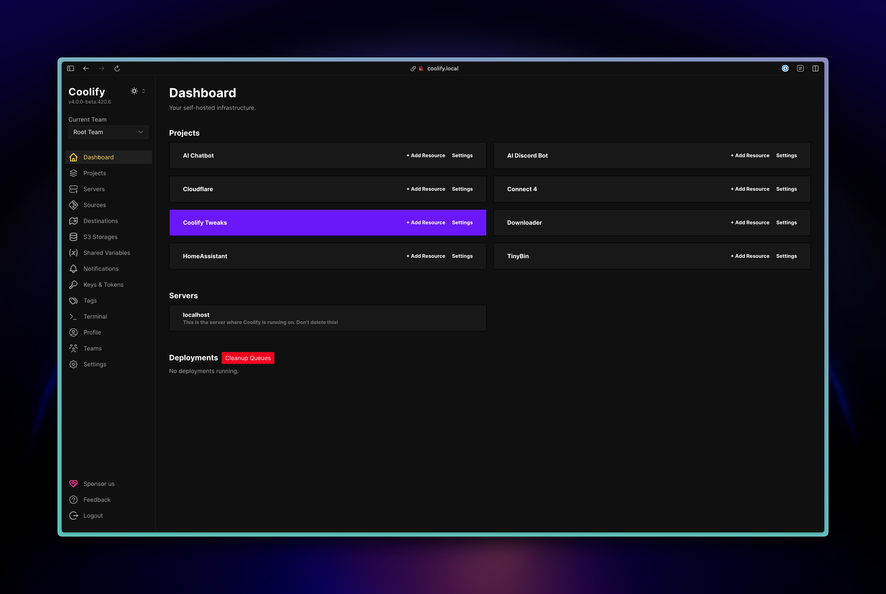

</td>
<td width="50%">

**After**
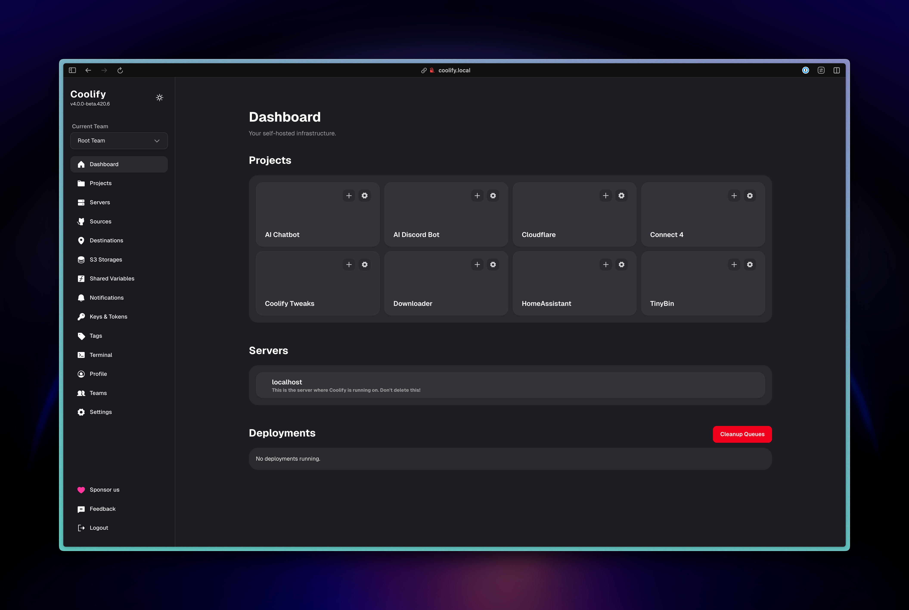

</td>
</tr>
</table>

---

## 2. Create New Project

<table>
<tr>
<td width="50%">

**Before**
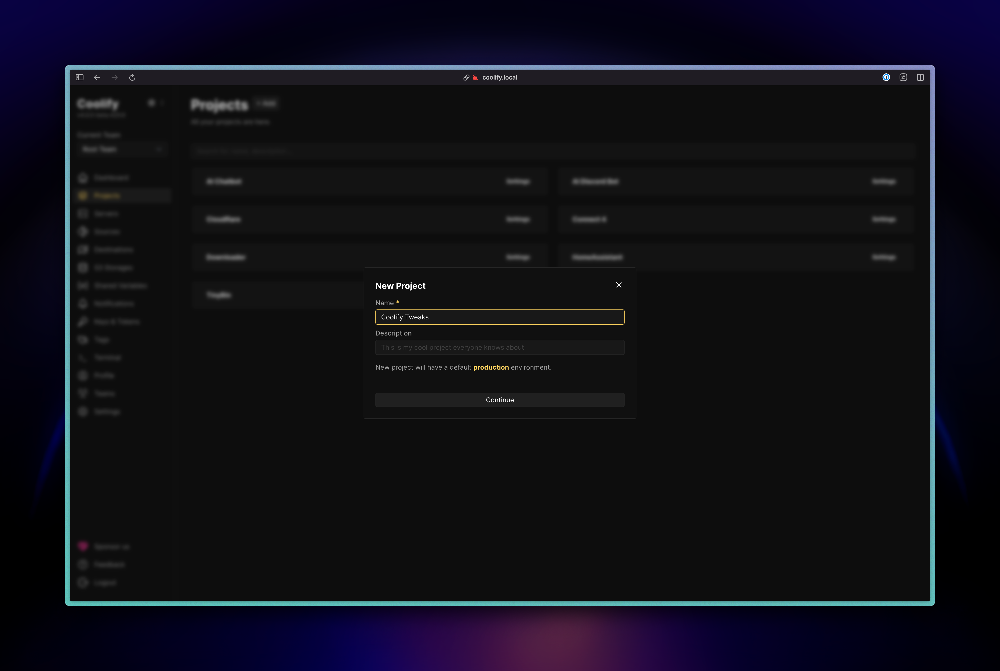

</td>
<td width="50%">

**After**

</td>
</tr>
</table>

---

## 3. Environment Settings

<table>
<tr>
<td width="50%">

**Before**

</td>
<td width="50%">

**After**
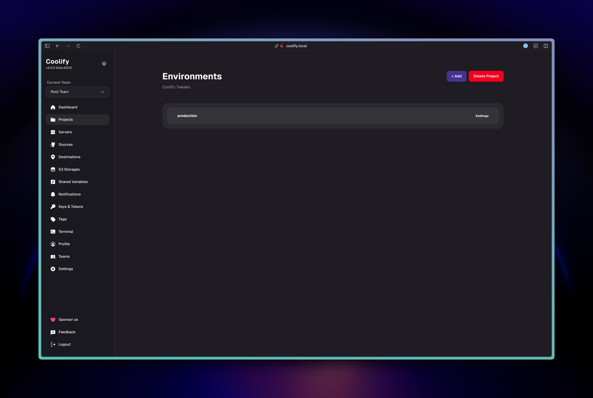

</td>
</tr>
</table>

---

## 4. New Resource Page

<table>
<tr>
<td width="50%">

**Before**

</td>
<td width="50%">

**After**
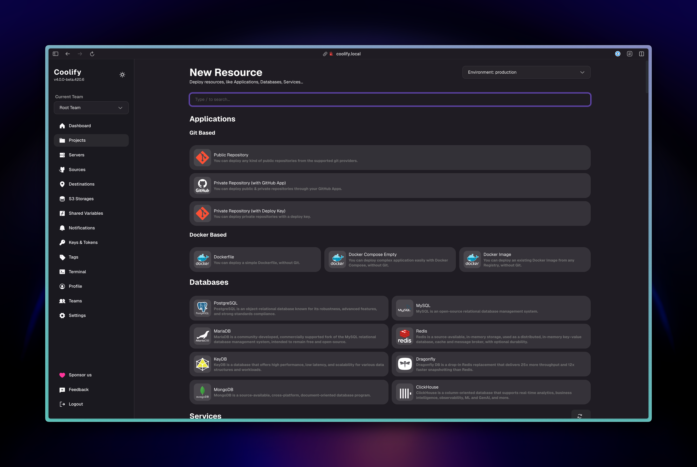

</td>
</tr>
</table>

---

## 6. Resource Settings

<table>
<tr>
<td width="50%">

**Before**
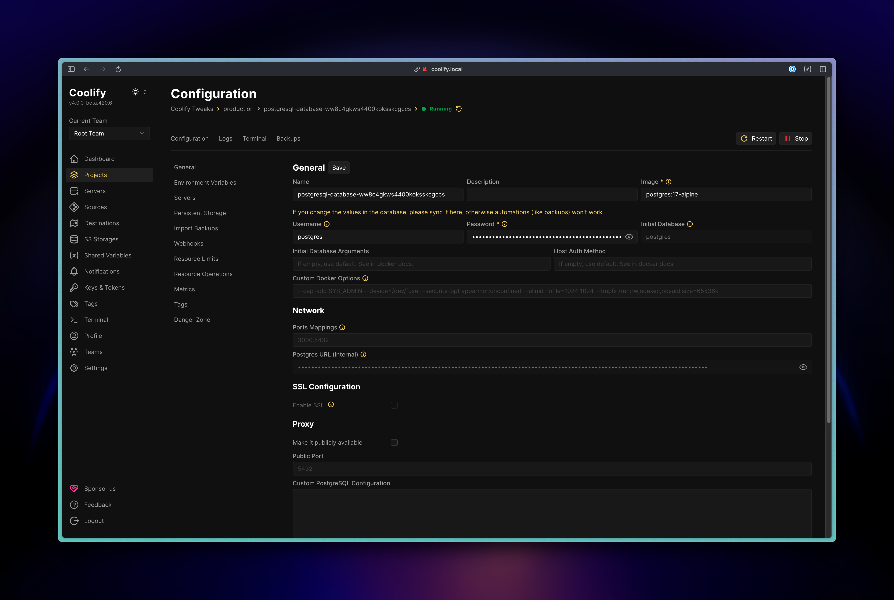

</td>
<td width="50%">

**After**
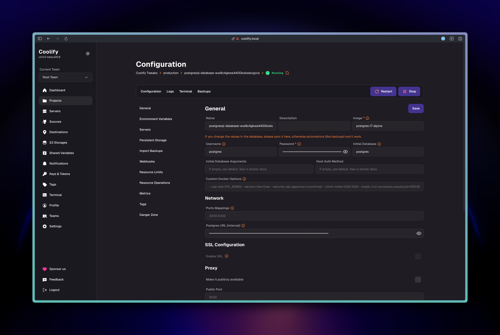

</td>
</tr>
</table>

---

## 5. Resource Environment Variables

<table>
<tr>
<td width="50%">

**Before**

</td>
<td width="50%">

**After**
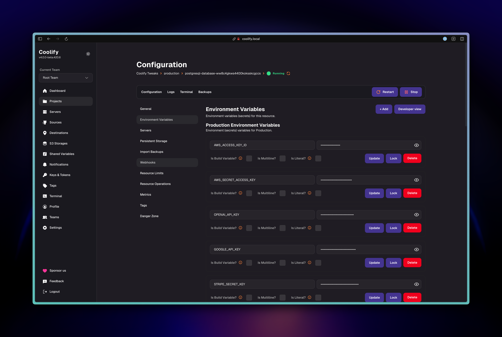

</td>
</tr>
</table>

---

## 7. Resource Logs

<table>
<tr>
<td width="50%">

**Before**

</td>
<td width="50%">

**After**
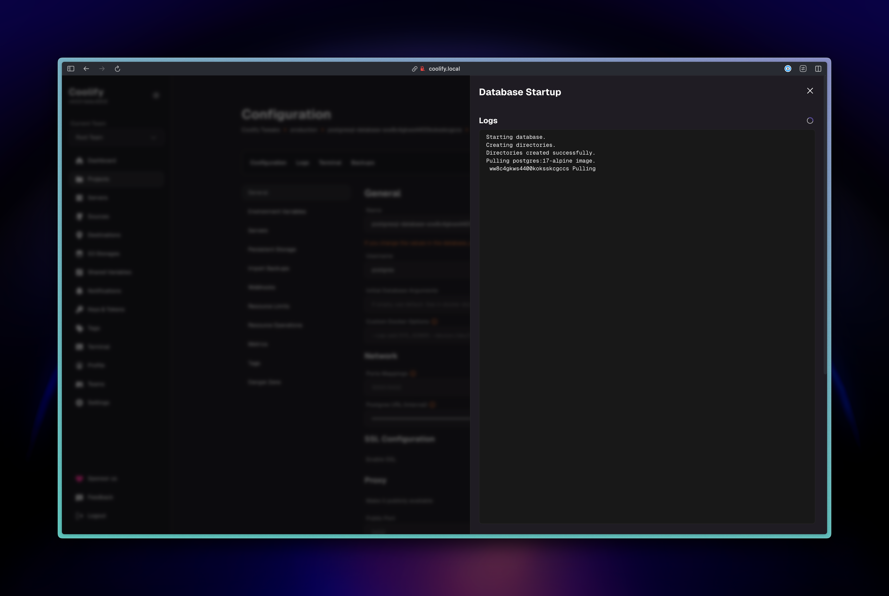

</td>
</tr>
</table>

---

## 8. Resource Terminal

<table>
<tr>
<td width="50%">

**Before**

</td>
<td width="50%">

**After**
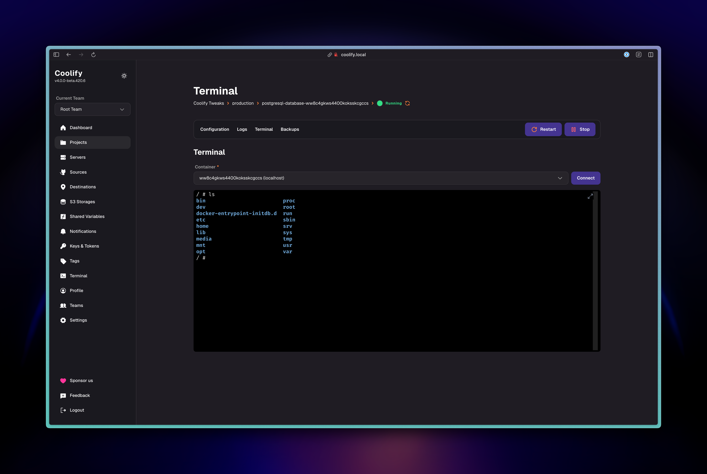

</td>
</tr>
</table>

---

## 9. Resource Backup

<table>
<tr>
<td width="50%">

**Before**

</td>
<td width="50%">

**After**

</td>
</tr>
</table>

---

## 10. Servers Page

<table>
<tr>
<td width="50%">

**Before**

</td>
<td width="50%">

**After**

</td>
</tr>
</table>

---

## 11. Server Settings

<table>
<tr>
<td width="50%">

**Before**

</td>
<td width="50%">

**After**
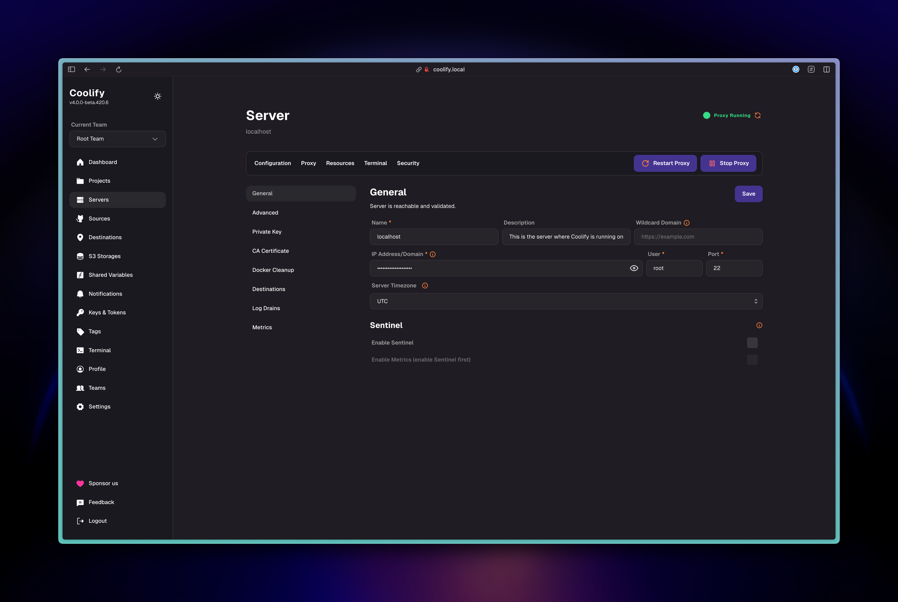

</td>
</tr>
</table>

---

## 12. Server Resources

<table>
<tr>
<td width="50%">

**Before**
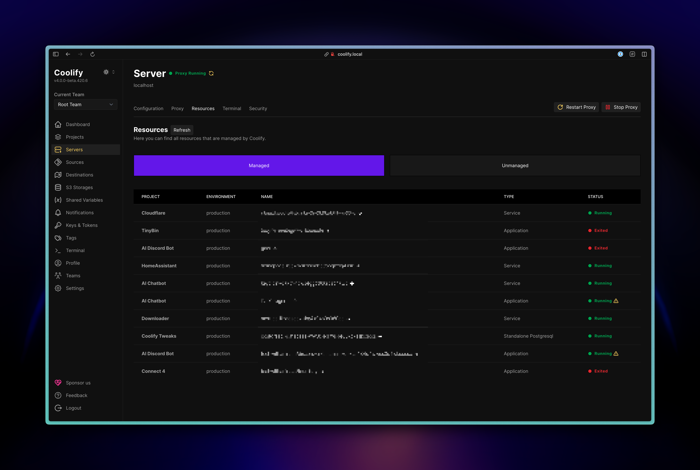

</td>
<td width="50%">

**After**

</td>
</tr>
</table>

---

## 13. Tags Page

<table>
<tr>
<td width="50%">

**Before**

</td>
<td width="50%">

**After**

</td>
</tr>
</table>

---

## 14. Profile Page

<table>
<tr>
<td width="50%">

**Before**

</td>
<td width="50%">

**After**
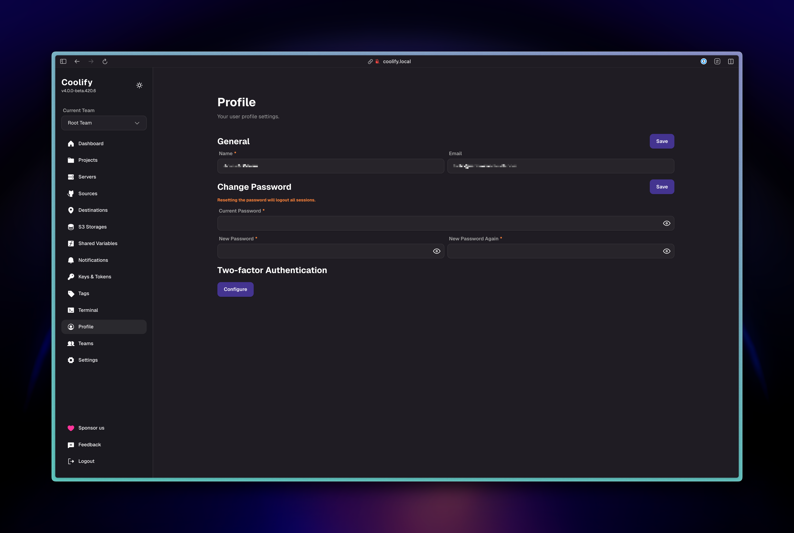

</td>
</tr>
</table>

---